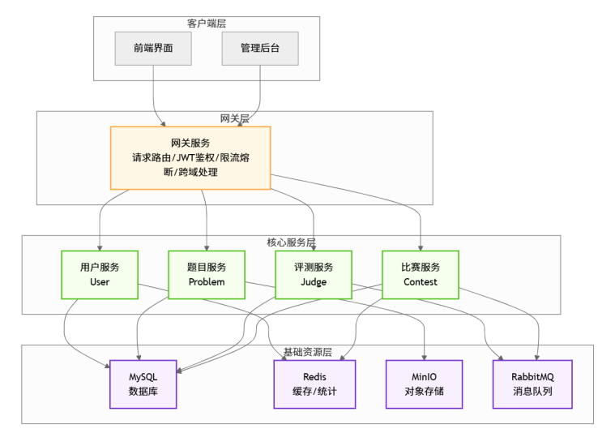
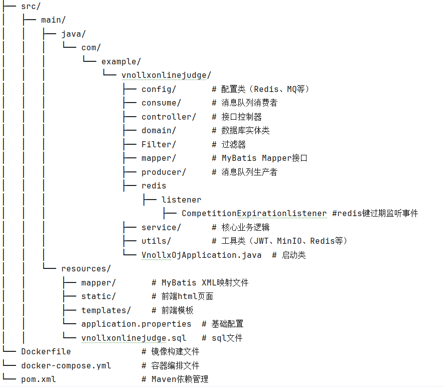

# VnollxOnlineJudge - 在线编程评测系统 🌟

## 🚀 项目简介
VnollxOnlineJudge 是一款功能全面的在线编程评测系统（OJ），面向编程学习者、竞赛选手及技术社区，提供题目提交、代码评测、题解分享、比赛参与等核心功能。系统采用高并发架构设计，结合分布式缓存、消息队列及对象存储技术，保障在高流量场景下的稳定性与性能。

---

## 🔧 技术栈与架构

### 核心技术选型
| 技术栈                 | 说明                             |
|---------------------|--------------------------------|
| **Spring Boot**     | 快速构建后端服务，集成自动化配置与依赖管理          |
| **MyBatis-Plus**    | ORM框架，简化数据库操作，支持高效CRUD与条件查询    |
| **MySQL**           | 主数据库，存储用户信息、题目数据、提交记录等核心业务数据   |
| **Redis**           | 缓存热点数据（如排行榜、用户会话），支持原子操作（AC数/通过数统计） |
| **RabbitMQ**        | 消息队列，缓冲代码评测请求，实现异步处理与流量削峰      |
| **MinIO**           | 对象存储，安全存储题测试用例代码文件             |
| **go-Judge,Docker** | 容器化部署评测沙箱，隔离代码执行环境，保障系统安全      |

### 系统架构图

---

## 🌟 核心功能

### ✨ 用户模块
- **账号体系**：支持邮箱/手机号注册登录，集成验证码校验
- **个人中心**：修改昵称、题目测试用例压缩包（MinIO存储）、密码，查看个人提交统计（AC数、通过题目）
- **社交功能**：查看他人主页（AC数、通过题目列表）

### 📚 题目模块
- **题目广场**：支持关键词搜索、难度筛选（简单/中等/困难）、标签过滤（动态规划/图论等）
- **题目详情**：包含题目描述、输入输出样例、测试用例说明、提交记录统计（AC率/通过数）
- **代码提交**：在线代码编辑器（支持Java/C++/Python语法高亮），实时显示评测结果（AC/WA/TLE等）

### ⚖️ 评测模块
- **多语言支持**：Java、C++、Python（可扩展Go/JavaScript等）
- **异步评测**：提交请求入RabbitMQ队列，后台worker消费并执行，对消息进行持久化和手动消息确认保证数据不丢失
- **结果反馈**：返回运行时间、内存占用、错误详情（如编译错误日志、运行时异常）

### 🏆 比赛模块
- **比赛管理**：管理员创建比赛（设置时间、题目集、参赛权限），支持公开赛/私有赛
- **实时排行**：基于Redis ZSet实现，按AC数+罚时排序，支持刷新实时更新
- **比赛记录**：赛后生成成绩报告（个人排名、题目AC情况）

### 📝 题解模块
- **题解发布**：支持Markdown编辑，插入代码块、图片（MinIO存储）、公式
- **题解互动**：点赞、收藏、评论，作者可置顶/删除评论

---

## 🚀 高并发优化

| 场景      | 解决方案                                              |
|---------|---------------------------------------------------|
| 题目AC数统计 | Redis原子操作（INCR），键过期事件同步至MySQL，采用缓存过期缓冲策略保证数据最终一致性 |
| 比赛排行榜   | Redis ZSet存储（用户ID+分数(通过AC数和罚时计算)），O(logN)复杂度查询    |
| 评测请求峰值  | RabbitMQ队列缓冲，动态扩容评测worker实例                       |
| 热点题目访问  | Redis缓存题目详情，减少MySQL查询                             |
| 提交记录存储  | Redis List暂存，定时任务批量写入MySQL（降低IO压力）                |
| 数据库主从复制 | 将读写请求分开，降低主库压力，后续为了实现高可用，可采用故障自动转移，当主库故障时，从库自动升级  |
---

## 📦 快速部署

### 环境要求
| 软件       | 版本要求          | 说明                      |
|----------|---------------|-------------------------|
| JDK      | 11+           | Spring Boot 3.0+依赖      |
| MySQL    | 8.0+          | 需开启UTF-8mb4字符集          |
| Redis    | 6.0+          | 需启用持久化（RDB/AOF）         |
| RabbitMQ | 3.10+         | 安装rabbitmq-management插件 |
| MinIO    | RELEASE.2023* | 对象存储服务                  |
| Docker   | 20.10+        | 用于容器化部署                 |
| Go-Judge | 最新版           | 用于代码沙箱隔离                |

### 部署步骤

#### 1. 克隆项目
git clone https://github.com/Vnollx-ww/VnollxOnlineJudge.git
#### 2. 初始化数据库
运行位于/src/main/resources下的vnollxonlinejudge.sql文件
#### 3. 配置修改# 修改 application.properties
修改MYSQL,Redis,RabbitMq,Minio配置
#### 4. 构建与启动# 打包（跳过测试）
mvn clean package -DskipTests
#### 5. 采用docker本地部署
下载docker，在VnollxOnlineJudge下运行命令docker-compose up -d

# 启动服务
java -jar target/vnollx-oj-1.0.0.jar --spring.profiles.active=prod
#### 5. 验证部署
- 访问项目主页：`http://localhost:8080
- 访问MinIO控制台：`http://localhost:9001`（默认账号/密码：minioadmin/minioadmin）

---

## 📁 项目结构vnollxonlinejudge/

---

如果这个项目对你有帮助，欢迎点个Star支持～ ⭐  
[GitHub仓库地址](https://github.com/your-username/VnollxOnlineJudge)
