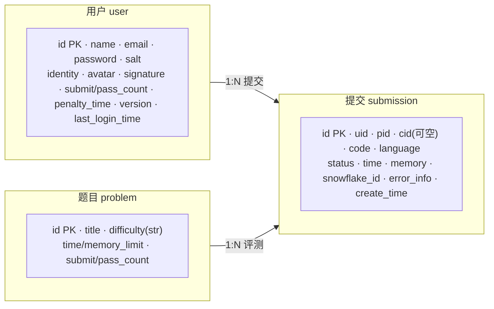
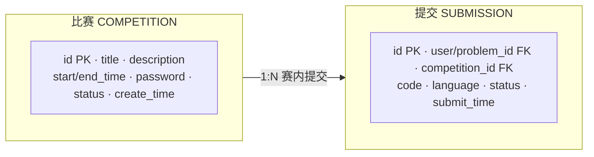
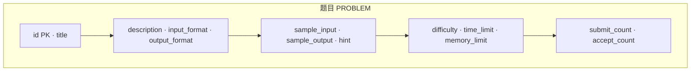
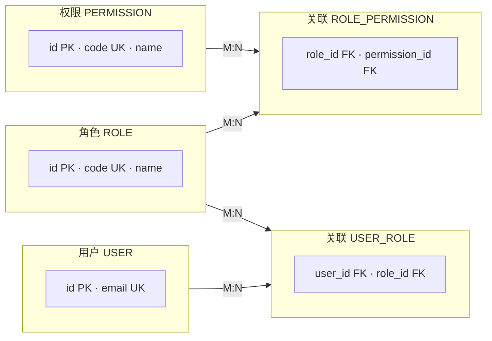
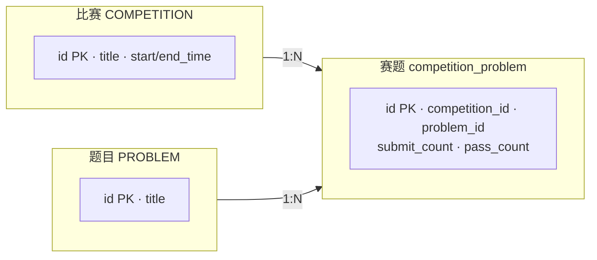
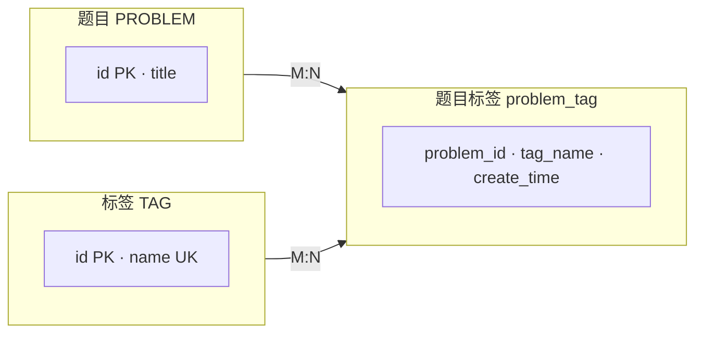

# 数据库 E-R 图（Mermaid）

论文或文档中可直接引用下列代码块；渲染需支持 Mermaid。

说明：Mermaid 的 `erDiagram` 不便排版时，分图 **A～F** 用 **`flowchart LR`**；**图 G 总览** 用 **`flowchart TB`** + 各段内 **`direction TB`**，整体自上而下竖排。

---

## 图 A：用户 ↔ 题目 ↔ 提交

---

## 图 B：比赛 ↔ 提交

---

## 图 C：题目字段展开（仅实体）

---

## 图 D：RBAC（用户—角色—权限）

---

## 图 E：比赛 ↔ 题目（多对多）

---

## 图 F：题目 ↔ 标签（多对多）

---

## 图 G：总览（与仓库 `model/entity` 一致的持久化实体）

以下 **27 张表** 对应 `src/main/java/.../model/entity` 中带 `@Table` / `@TableName` 的类（**不含** `JudgeInfo`，该类为判题 MQ 消息体，非数据库表）。

| 表名 | 实体类 |
|------|--------|
| `user` | User |
| `problem` | Problem |
| `problem_example` | ProblemExample |
| `problem_tag` | ProblemTag |
| `tag` | Tag |
| `submission` | Submission |
| `competition` | Competition |
| `competition_problem` | CompetitionProblem |
| `competition_user` | CompetitionUser |
| `practice` | Practice |
| `practice_problem` | PracticeProblem |
| `solve` | Solve |
| `comment` | Comment |
| `user_solver_problem` | UserSolvedProblem |
| `user_tag` | UserTag |
| `friend` | Friend |
| `private_message` | PrivateMessage |
| `notification` | Notification |
| `role` | Role |
| `permission` | Permission |
| `user_role` | UserRole |
| `role_permission` | RolePermission |
| `ai_platform` | AiPlatform |
| `ai_model` | AiModel |
| `ai_chat_session` | AiChatSession |
| `ai_chat_record` | AiChatRecord |
| `ai_chat_summary` | AiChatSummary |

**总 E-R 图（字号放大：`themeVariables.fontSize` + 节点内表名 `28px`；整体 **自上而下** 四段，每段内各表 **竖排**（`direction TB`），连线表示主要外键语义）**

```mermaid
%%{init: {
  'flowchart': { 'htmlLabels': true, 'curve': 'basis', 'nodeSpacing': 28, 'rankSpacing': 100, 'padding': 24 },
  'themeVariables': {
    'fontFamily': 'Microsoft YaHei, SimHei, Segoe UI, sans-serif',
    'fontSize': '24px',
    'primaryTextColor': '#0d0d0d'
  }
}}%%
flowchart TB
  subgraph G1["题目与标签"]
    direction TB
    t_tag["`<b style='font-size:28px'>tag</b><br/><span style='font-size:18px'>id · name</span>`"]
    t_pt["`<b style='font-size:28px'>problem_tag</b><br/><span style='font-size:18px'>problem_id · tag_name · create_time</span>`"]
    t_prob["`<b style='font-size:28px'>problem</b><br/><span style='font-size:17px'>id · title · description · time/memory_limit · difficulty · input/output_example · datazip · hint · io_format · submit/pass_count · open · version · snake_id</span>`"]
    t_pex["`<b style='font-size:28px'>problem_example</b><br/><span style='font-size:18px'>id · problem_id · input · output · sort_order · is_public</span>`"]
  end

  subgraph G2["用户 · 提交 · 比赛 · 练习"]
    direction TB
    t_user["`<b style='font-size:28px'>user</b><br/><span style='font-size:17px'>id · name · email · password · salt · identity · avatar · signature · submit/pass_count · penalty_time · version · last_login_time</span>`"]
    t_sub["`<b style='font-size:28px'>submission</b><br/><span style='font-size:17px'>id · uid · pid · cid · user_name · problem_name · code · language · status · time · memory · snowflake_id · error_info · create_time</span>`"]
    t_comp["`<b style='font-size:28px'>competition</b><br/><span style='font-size:18px'>id · title · description · begin/end_time · password · need_password · number</span>`"]
    t_cprob["`<b style='font-size:28px'>competition_problem</b><br/><span style='font-size:18px'>id · competition_id · problem_id · submit_count · pass_count</span>`"]
    t_cuser["`<b style='font-size:28px'>competition_user</b><br/><span style='font-size:18px'>competition_id · user_id · name · pass_count · penalty_time</span>`"]
    t_prac["`<b style='font-size:28px'>practice</b><br/><span style='font-size:18px'>id · title · description · create_time · is_public</span>`"]
    t_pprob["`<b style='font-size:28px'>practice_problem</b><br/><span style='font-size:18px'>id · practice_id · problem_id · problem_order</span>`"]
  end

  subgraph G3["题解 · 评论 · 通过记录 · 社交 · 通知"]
    direction TB
    t_solve["`<b style='font-size:28px'>solve</b><br/><span style='font-size:18px'>id · uid · pid · title · content · status · create_time · name · problem_name</span>`"]
    t_comm["`<b style='font-size:28px'>comment</b><br/><span style='font-size:18px'>id · user_id · problem_id · parent_id · content · username · create_time</span>`"]
    t_usp["`<b style='font-size:28px'>user_solver_problem</b><br/><span style='font-size:18px'>user_id · problem_id · competition_id · problem_name</span>`"]
    t_utag["`<b style='font-size:28px'>user_tag</b><br/><span style='font-size:18px'>id · uid · tag · submit_count · pass_count</span>`"]
    t_fr["`<b style='font-size:28px'>friend</b><br/><span style='font-size:18px'>id · user_id · friend_id · status · create/update_time</span>`"]
    t_pm["`<b style='font-size:28px'>private_message</b><br/><span style='font-size:17px'>id · sender_id · receiver_id · content · is_read · deleted_by_sender/receiver · create_time</span>`"]
    t_not["`<b style='font-size:28px'>notification</b><br/><span style='font-size:18px'>id · uid · title · description · is_read · comment_id · create_time</span>`"]
  end

  subgraph G4["RBAC · AI"]
    direction TB
    t_role["`<b style='font-size:28px'>role</b><br/><span style='font-size:18px'>id · code · name · description · status · create/update_time</span>`"]
    t_ur["`<b style='font-size:28px'>user_role</b><br/><span style='font-size:18px'>id · user_id · role_id · create_time</span>`"]
    t_perm["`<b style='font-size:28px'>permission</b><br/><span style='font-size:17px'>id · code · name · description · module · status · create/update_time</span>`"]
    t_rp["`<b style='font-size:28px'>role_permission</b><br/><span style='font-size:18px'>id · role_id · permission_id · create_time</span>`"]
    t_aip["`<b style='font-size:28px'>ai_platform</b><br/><span style='font-size:18px'>id · code · name · description · sort · status · times</span>`"]
    t_aim["`<b style='font-size:28px'>ai_model</b><br/><span style='font-size:17px'>id · name · logo_url · api_key · extra_config · sort · status · proxy_type · times</span>`"]
    t_ais["`<b style='font-size:28px'>ai_chat_session</b><br/><span style='font-size:16px'>id · user_id · title · last_model_id · message_count · last_message_at · times</span>`"]
    t_air["`<b style='font-size:28px'>ai_chat_record</b><br/><span style='font-size:15px'>id · user_id · model_id · session_id · messages · tokens · latency · status · error · times</span>`"]
    t_aisu["`<b style='font-size:28px'>ai_chat_summary</b><br/><span style='font-size:17px'>id · user_id · session_id · summary_content · covered_* · times</span>`"]
  end

  t_tag --- t_pt
  t_prob --- t_pt
  t_prob --> t_pex

  t_user --> t_sub
  t_prob --> t_sub
  t_comp -.->|cid 可空| t_sub
  t_comp --> t_cprob
  t_prob --> t_cprob
  t_comp --> t_cuser
  t_user --> t_cuser
  t_prac --> t_pprob
  t_prob --> t_pprob

  t_user --> t_solve
  t_prob --> t_solve
  t_user --> t_comm
  t_prob --> t_comm
  t_user --> t_usp
  t_prob --> t_usp
  t_comp -.-> t_usp
  t_user --> t_utag
  t_user --> t_fr
  t_user --> t_pm
  t_user --> t_not

  t_user --> t_ur
  t_role --> t_ur
  t_role --> t_rp
  t_perm --> t_rp
  t_user --> t_ais
  t_aim --> t_air
  t_ais --> t_air
  t_user --> t_air
  t_user --> t_aisu
  t_ais --> t_aisu
```

> **说明**：`problem_tag`、`competition_user`、`user_solver_problem` 等在 Java 里未标 `@TableId` 或主键形态与常见自增 id 不同，**以实际 MySQL 表结构为准**（若表中有联合主键，论文表结构一节写明即可）。`ai_platform` 与 `ai_model` 在实体中未声明互相关联字段，图上并列表示 AI 配置域；若库表有 `platform_id` 请自行加一条虚线。若渲染器不支持 `htmlLabels`，可去掉 `%%{init...}%%` 中的 `htmlLabels: true`，或升级 Mermaid；否则节点内 `<b style=...>` 可能显示为原文。
